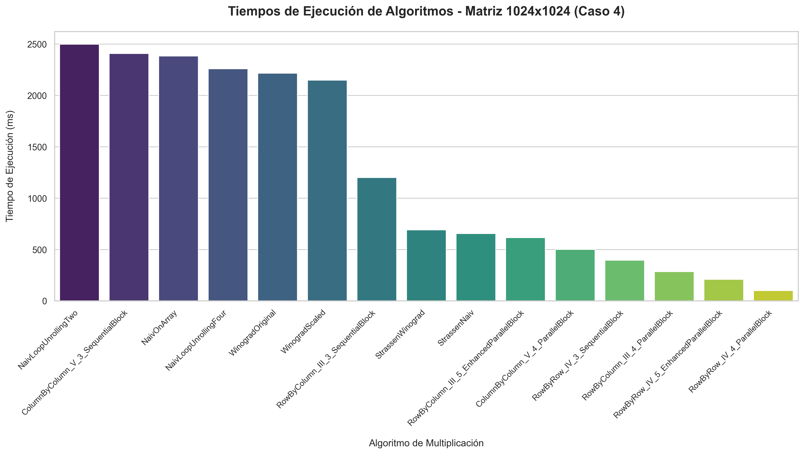

# Seguimiento 2: Multiplicación de matrices grandes

## 1. Propósito y Metodología
En esta fase del proyecto, el objetivo principal fue analizar empíricamente el rendimiento de los 15 algoritmos de multiplicación de matrices implementados. Para garantizar la confiabilidad y persistencia de las condiciones iniciales, las matrices aleatorias de tamaño $n \times n$ (con elementos enteros $\ge 100000$) fueron generadas y almacenadas consistentemente, asegurando que todos los algoritmos partieran exactamente del mismo dataset en memoria y no hubiera sesgos por los datos introducidos.

En cuanto a la medición de tiempos, se utilizó el método `System.nanoTime()` nativo de Java para obtener estimaciones de la más alta precisión y evitar los redondeos característicos de la medición en milisegundos directos de bajo nivel. De esta manera mitigamos posibles anomalías y nos acercamos a la verdadera medida del costo computacional de cada enfoque.

## 2. Análisis de Complejidad Teórica
A continuación, se detalla la Tabla de Complejidad Asintótica para todas las variaciones implementadas en la suite, considerando algoritmos clásicos y de Divide y Vencerás.

| #  | Algoritmo | Categoría / Familia | Complejidad Teórica |
|----|:---|:---|:---|
| 1  | Naiv Standard | Clásico Secuencial | $O(n^3)$ |
| 2  | Naiv On-Demand | Clásico Secuencial | $O(n^3)$ |
| 3  | Naiv Loop Unrolling Two | Clásico Optimizado | $O(n^3)$ |
| 4  | Naiv Loop Unrolling Four | Clásico Optimizado | $O(n^3)$ |
| 5  | Winograd Original | Divide y Vencerás | $O(n^3)$ |
| 6  | Winograd Scaled | Divide y Vencerás | $O(n^3)$ |
| 7  | Strassen Naiv | Divide y Vencerás | $O(n^{2.81})$ |
| 8  | Strassen Winograd | Divide y Vencerás | $O(n^{2.81})$ |
| 9  | Sequential Block | Optimizado por Bloques | $O(n^3)$ |
| 10 | Parallel Block | Paralelizado por Bloques | $O(n^3)$ |
| 11 | Enhanced Parallel Block | Paralelizado Avanzado | $O(n^3)$ |
| 12 | Row by Row V1 | Reestructuración Lineal | $O(n^3)$ |
| 13 | Row by Row V2 | Reestructuración Lineal | $O(n^3)$ |
| 14 | Row by Row V3 | Reestructuración Lineal | $O(n^3)$ |
| 15 | Row by Row IV (Parallel) | Reestructuración Paralela | $O(n^3)$ |

## 3. Resultados Empíricos (Diagramas de Barras)

<!-- 
Los gráficos deben ser generados previamente ejecutando el script de Python adjunto en la raíz "generar_graficos.py". 
Una vez ejecutado, las imágenes PNG se guardarán automáticamente en esta misma carpeta y se renderizarán a continuación.
Si los tamaños N de sus pruebas difieren de 1024 y 2048, actualice el nombre de los archivos referenciados.
-->

### Caso 1 (Primer tamaño de matriz evaluado)

### Caso 2 (Segundo tamaño de matriz evaluado)

## 4. Análisis Técnico y Conclusiones

### 4.1. El impacto del Loop Unrolling y la reestructuración secuencial
*<Espacio destinado para el análisis: Detalle sus hallazgos empíricos comparando los tiempos de ejecución de las versiones Naiv Standard frente a Naiv Loop Unrolling y las estrategias secuenciales>*

### 4.2. Divide y Vencerás (Strassen vs. Winograd): Reducción de operaciones aritméticas reales frente al overhead recursivo
*<Espacio destinado para el análisis: Analícelos comprobando si la reducción teórica de operaciones justifica el costo de la recursividad en Java y el efecto de los tamaños de matriz>*

### 4.3. Física del Hardware: El poder de la localidad espacial (Caché L1/L2 por bloques) y la concurrencia nativa
*<Espacio destinado para el análisis: Exponga cómo la organización por bloques y la optimización lineal aprovecharon la arquitectura de memoria (cache hits) y los beneficios definitivos de los hilos (concurrencia)>*
